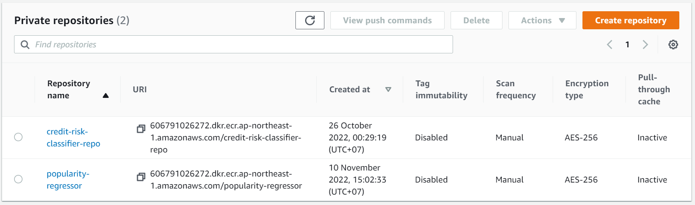
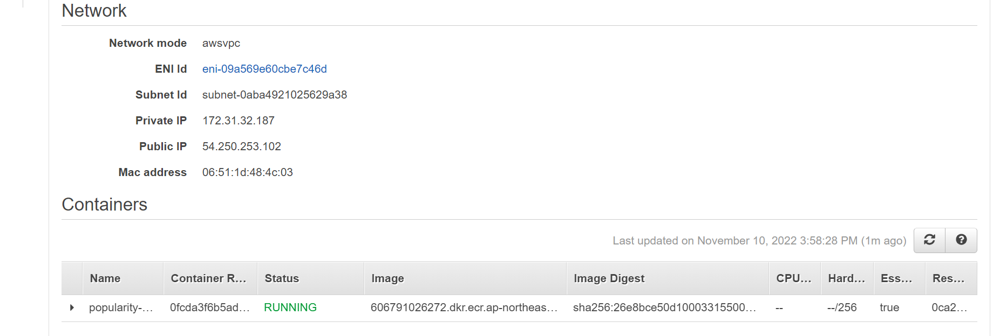
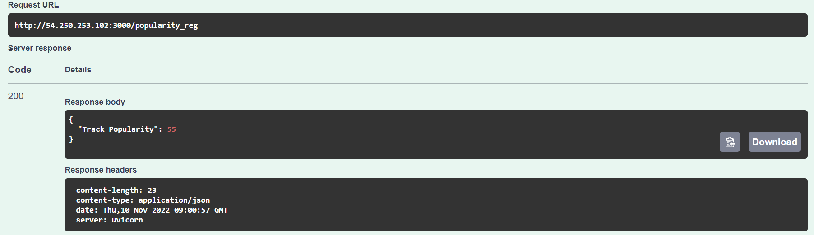

# Predicting Spotify Track's Popularity from K-pop Groups <br>based on the Profile of Track and Group

## Problem Statement
Korean music has been acknowledged massively in the entire world. The training system for korean idols are still happening. Every year in Korea, many entertainment companies make debuts their produced k-pop groups. Spotify as the global streaming platform distributed k-pop songs to all over the world. Kpop songs frequently charting and become popular stream in Spotify.

This analysis began for predicting k-pop track's popularity on Spotify with regression method (linear regression, decision tree, random forest, and XG Boost). The track's popularity in Spotify is a range from 0 to 100. For independent variables we're using song/track's profile (musicality, duration, artists popularity, spotify followers) and k-pop group's profile (average age of members, days from debut, their company, active status).

The exploratory data analysis (EDA) is done in notebook `analysis.ipynb`. Four method of regression is applied with parameter tuning. Concluded from this notebook the best model for this Popularity Regressor is Random Forest Regression. 

## Preparation to Use this Repo
Datasets has been downloaded and scraped in `data` folder. There are 5 datasets consists of :
- `artists.csv`: Spotify artists profile
- `tracks.csv`: Spotify tracks description
- `kpop_bg.csv`: Kpop boygroup database
- `kpop_gg.csv`: Kpop girlgroup database
- `kpop_all_idols.csv`: Personal profile of group's members

These are the source links of Spotify and Kpop Data :
- [Spotify Dataset 1921-2020, 600k+ Tracks](https://www.kaggle.com/datasets/yamaerenay/spotify-dataset-19212020-600k-tracks)
- [Kpop Database](https://dbkpop.com/) (The data have been scraped, the scraping code can be seen in `scrape_data.ipynb`)

## Requirements and Scripts
This analysis performed using `Ubuntu 22.04` and `Python 3.9.13`. Before running this analysis on your machine, install the right version of packages in `requirements.txt` with this syntax:

```pip install -r requirements.txt```

For deployment requirements, use the file `bentofile.yaml`.

These are the scripts i used:
- `scrape_data.ipynb` : Script for scraping Kpop Database tables in kpdb.com 
- `analysis.ipynb` : Script for preparing dataset, doing EDA, regression analysis, parameter tuning, and model selection
- `train.py`: Script for training data using Random Forest (the best model selected) and save the model with bentoml
- `service.py`: Deployment script, load model from bentoml and serving API using Flask

## Deployment in Localhost
1. Open terminal (bash) go to the path where you clone the repository
2. Run training model to save the bentoml model. <br>
```$ python train.py```
3. The prediction service has been made in `service.py`, you can try to deploy it without docker with this syntax below and try to access this url on your computer `localhost:3000` <br>
```$ bentoml serve service.py:svc --reload```
3. After `service.py` and `bentofile.yaml` ready, build the bento <br>
```$ bentoml build```
4. Build the docker image using containerize <br>
```bentoml containerize popularity_regressor:id5c3ptalsi76aav```
5. Run the docker, we're expecting service port 3000 or localhost:3000 and it'd take us to Swagger UI page <br>
```docker run -it --rm -p 3000:3000 popularity_regressor:id5c3ptalsi76aav```

## Cloud Deployment on AWS
Firstly, make sure you already created AWS account and IAM user. Get security credentials and install AWS CLI. Connect to AWS with local machine by running `aws configure`. These steps can be followed by watching this [tutorial](https://github.com/alexeygrigorev/mlbookcamp-code/blob/master/course-zoomcamp/07-bentoml-production/06-production-deployment.md).

1. Create Amazon Elastic Container Registry (ECR) repository. 
<br>Click Get Started > General settings > Create repository
<br>
<br>
2. Push our docker images in ECR using AWS CLI (Push syntax can be seen in **View push commands** button)
<br>Click on the repo name > View push commands > follow the instructions and skip step 2 (because bentoml has been built)
<br>
<br>
After the docker images pushed 
<br>
<br>

<br>
<br>
3. Find ECS (Elastic Container Service) in AWS web. 
<br>Create and Configure Cluster: Click Create Cluster > Networking only (CPU only) > follow the instructions.
<br>
<br>

<br>
<br>Create Task Definitions:
<br>Click Create new Task Definition > FARGRATE > Task memory (0.5GB), Task CPU (0.25 vCPU) > Add container (follow instructions and paste the image URI of ECR repo into the Image section, also increase the Soft limit to 256 and set Port mappings to 3000) > create task
<br>
<br>

<br>
<br>
<br>Run the Task:
<br>From ECS dashboard > Clusters > select the cluster we just created > Tasks > Run new Task > follow instructions (also select Launch type FARGATE, Operating system family Linux, Security groups set custom tcp to 3000) > create Task
<br>
<br>

<br>
<br>
4. Find Public IP to test the service
<br>
<br>



## Check Prediction Service via SwaggerUI
Input to test the prediction service `localhost:3000` (local deployment) or `54.250.253.102:3000` (cloud deployment)
<br> then click execute:

```
{
  "artist_popularity": 80,
  "duration_ms": 244867,
  "explicit": "non_explicit",
  "danceability": 0.447,
  "energy": 0.57,
  "time_signature": "4",
  "loudness": -6.196,
  "modality": "major",
  "speechiness": 0.0839,
  "acousticness": 0.138,
  "instrumentalness": 0.0,
  "liveness": 0.107,
  "valence": 0.37,
  "tempo": 79.801,
  "key": "F",
  "followers": 4344654.0,
  "big5_company": "True",
  "days_after_debut": 592,
  "mean_age_released": 19.625
}
```


With such data the result for predicting the track's popularity is:
<br>
<br>
